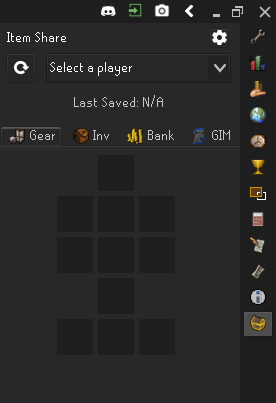
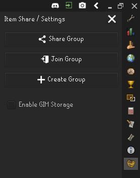
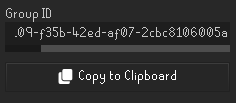
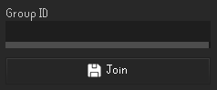
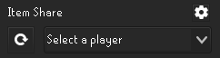
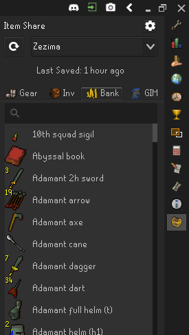

# Runelite Item Share Plugin

This plugin gives players the ability to share their Equipment, Inventory, Bank, and GIM Storage within their invite-only group of players

## Using the Plugin

### Installation
* Install the Item Share plugin from the Runelite Plugin Hub
* You should then see the item share icon appear in the Runelite sidebar
* At this stage you are currently assigned to an empty group

  

### Joining a group
* You can either invite players to your group or join someone else's group
* In either case, if you click the `Settings Button` 

  
* Click `Share Group`

  
* Click `Copy to Clipboard`
* You can now paste and share the Group ID with your friend `CTRL + V`
* Your friend can then go to Settings , click `Join Group`

  
* Your friend would then paste the Group ID, and click `Join`
* You are now both in the same group!

### Sharing your Items
* The plugin will automatically share your items with players in your group every 10 minutes
    * However, it will only share items that the plugin _**has actually viewed**_
    * This applies to your `Inventory`, `Equipment`, `Bank`, and `GIM Storage`
* On first time installing this plugin, simply open your `Bank` and click the `Sync Button` 
* The `Sync Button` will manually save your items for other players in your group to see

### Viewing others' Items
* To view other player items, simply select the player from the dropdown

  
* And click on any of the item tabs

  

* If their saved items are not showing up you can try hitting the `Sync Button` 

### Misc.
* Clicking any item icon will navigate you to its wiki page
* You can enable the GIM Storage item tab from your settings
    * Note: only **1** GIM Storage is saved per group
    * If multiple players belong to different GIM groups, then the last saved storage will be visible

## Feature Requests or Reporting a bug

If you have a feature request or have experienced any bugs, please [create an issue](https://github.com/vyxyl/item-share/issues/new) and add any necessary details